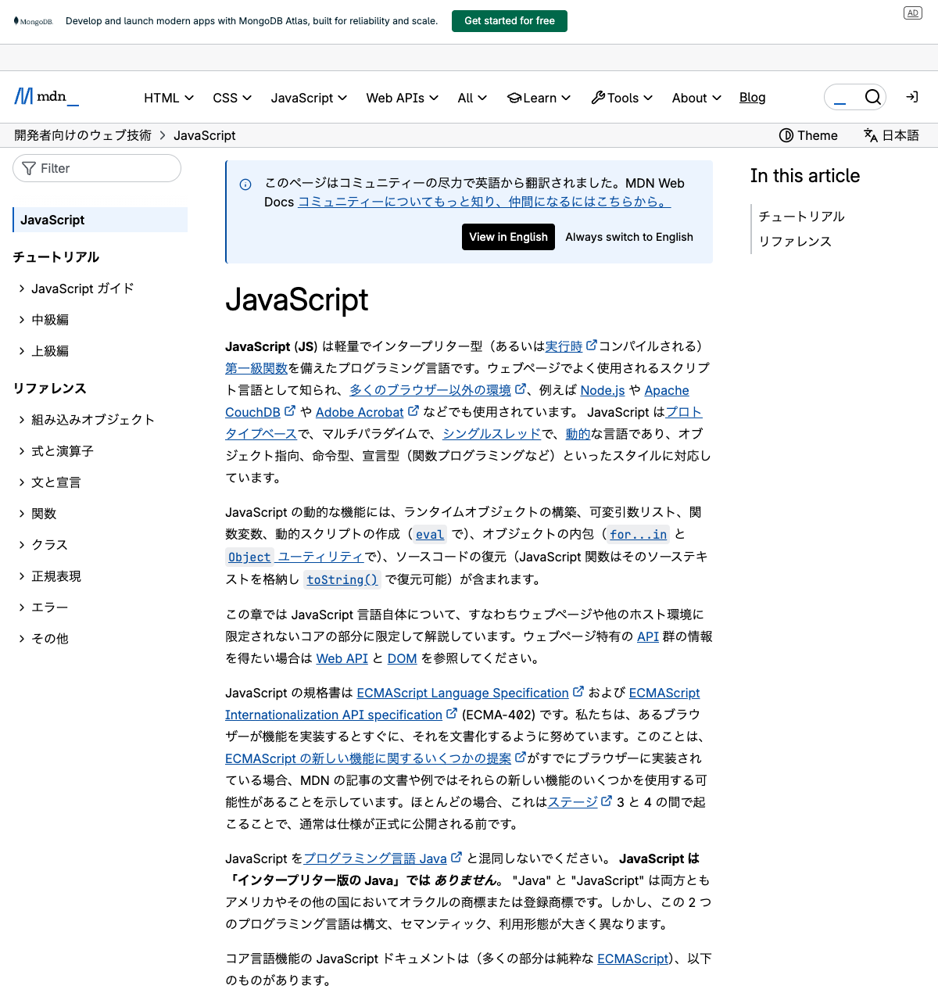
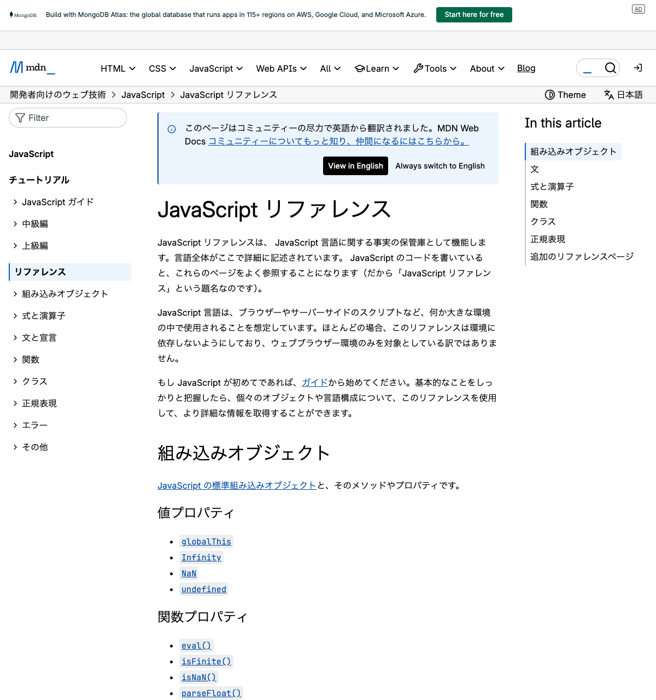
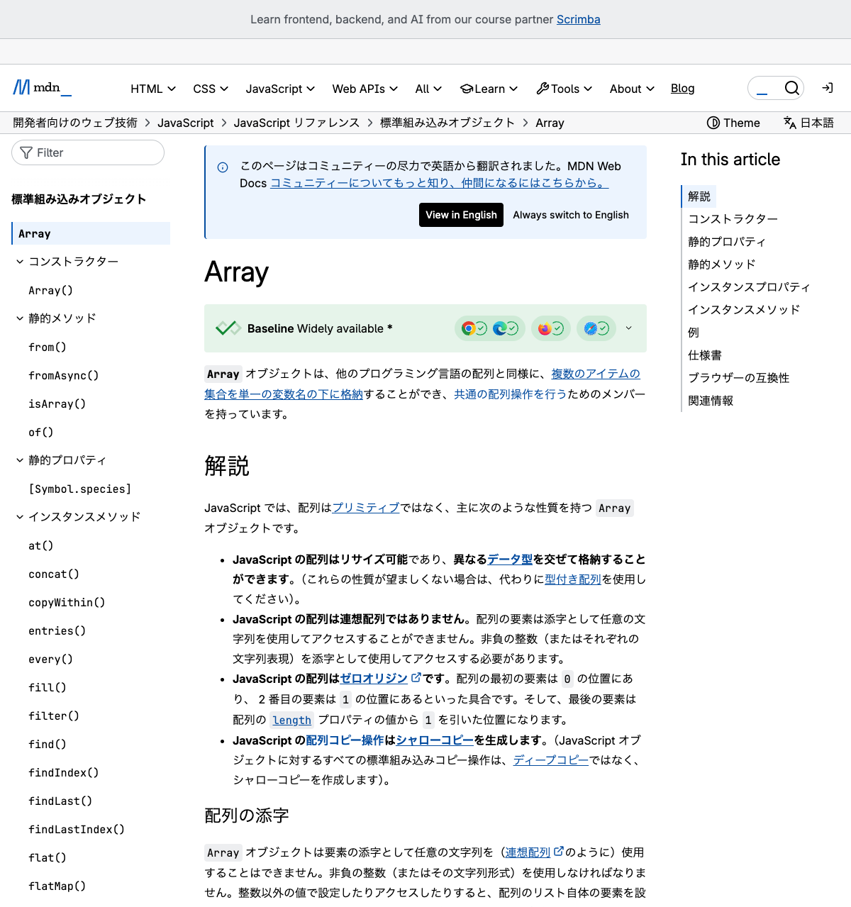
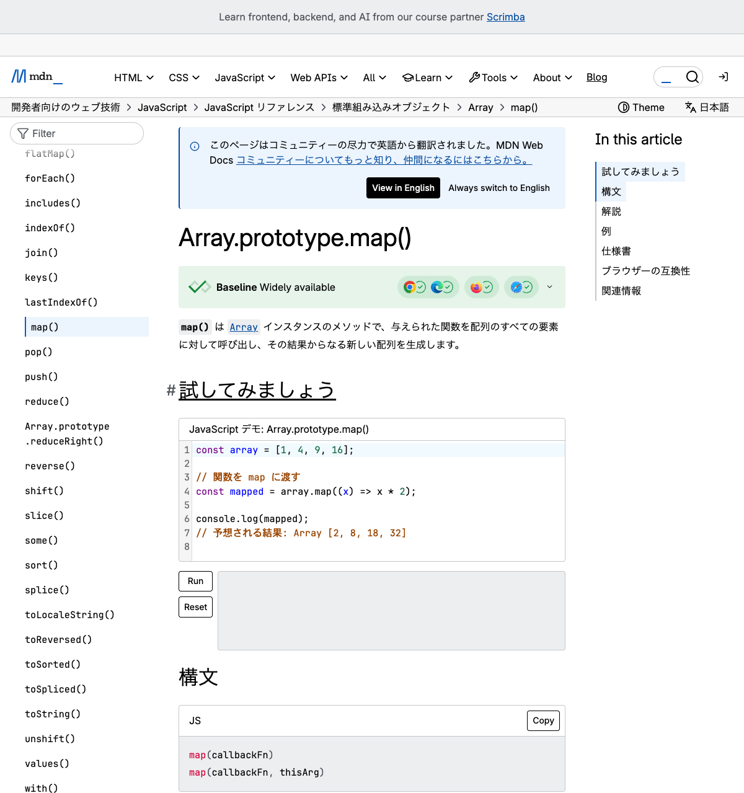

# MDN Web Docs Array.prototype.map() 操作手順書

本手順書では、MDN Web Docs のトップページから `Array.prototype.map()` のリファレンスページまで階層を辿って遷移する手順を説明します。

---

## ステップ 1: MDN Web Docs JavaScript ページを開く

ブラウザで以下の URL にアクセスし、MDN Web Docs の JavaScript ページを開きます。

**URL:** https://developer.mozilla.org/ja/docs/Web/JavaScript

---

## ステップ 2: JavaScript リファレンスページへ遷移

JavaScript ページ内にある「**JavaScript リファレンス**」のリンクをクリックして、リファレンスページへ遷移します。

**遷移先URL:** https://developer.mozilla.org/ja/docs/Web/JavaScript/Reference

---

## ステップ 3: Array ページへ遷移

JavaScript リファレンスページの組み込みオブジェクト一覧から「**Array**」のリンクをクリックして、Array のページへ遷移します。

**遷移先URL:** https://developer.mozilla.org/ja/docs/Web/JavaScript/Reference/Global_Objects/Array

---

## ステップ 4: Array.prototype.map() ページへ遷移

Array ページ内のインスタンスメソッド一覧から「**map()**」のリンクをクリックして、`Array.prototype.map()` のページへ遷移します。

**遷移先URL:** https://developer.mozilla.org/ja/docs/Web/JavaScript/Reference/Global_Objects/Array/map

---

## まとめ

| ステップ | 操作内容 | 遷移先ページ |
|---------|---------|-------------|
| 1 | MDN Web Docs JavaScript ページにアクセス | JavaScript \| MDN |
| 2 | 「JavaScript リファレンス」リンクをクリック | JavaScript リファレンス - JavaScript \| MDN |
| 3 | 「Array」リンクをクリック | Array - JavaScript \| MDN |
| 4 | 「map()」リンクをクリック | Array.prototype.map() - JavaScript \| MDN |
