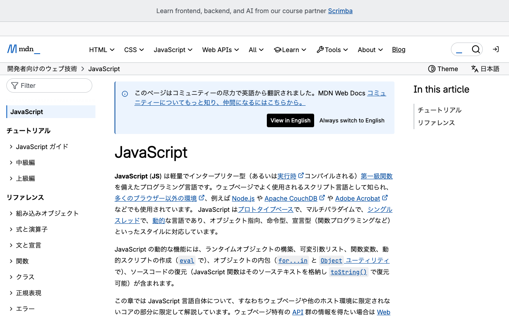
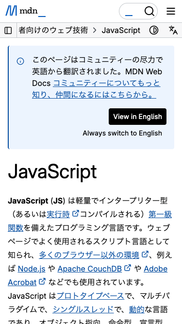
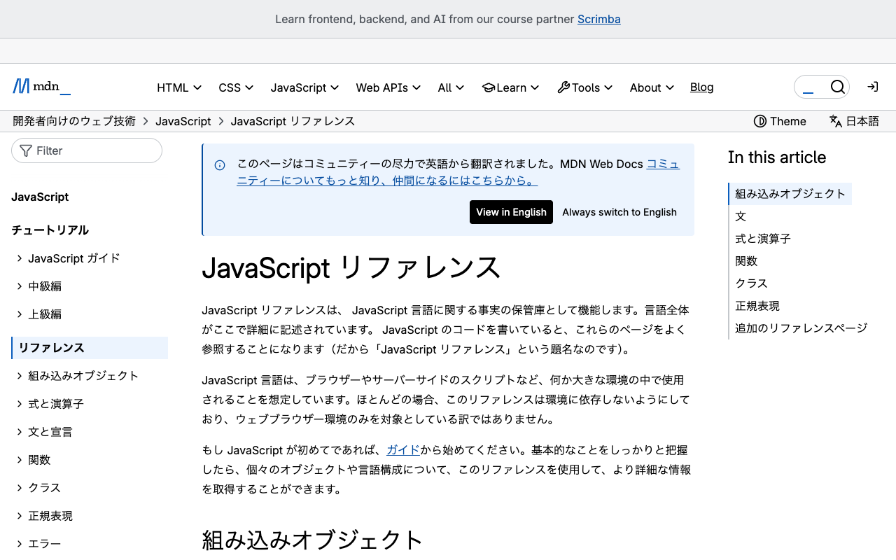
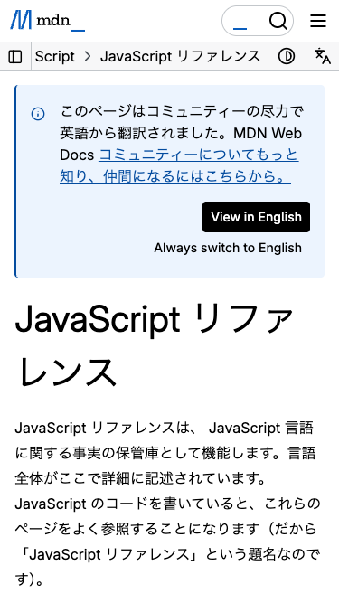
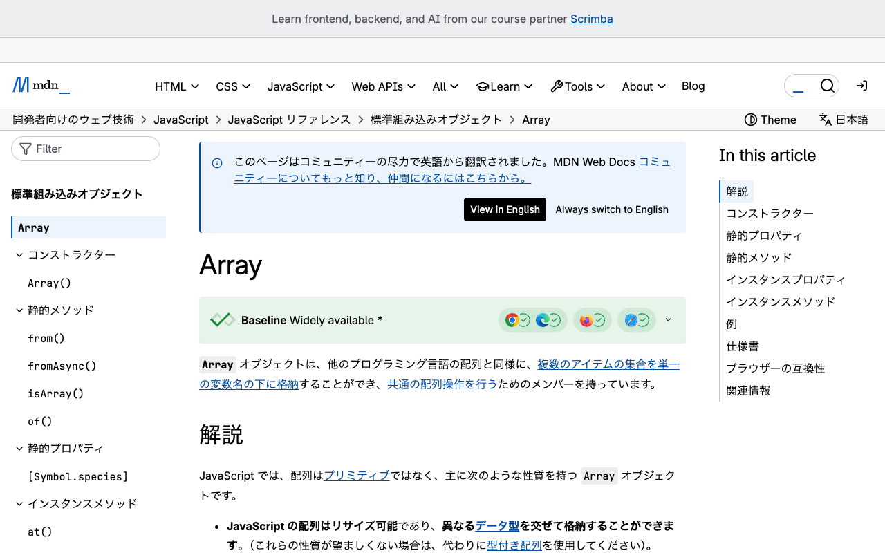
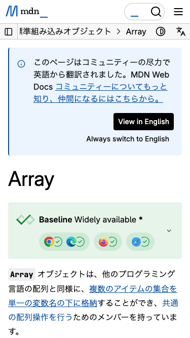
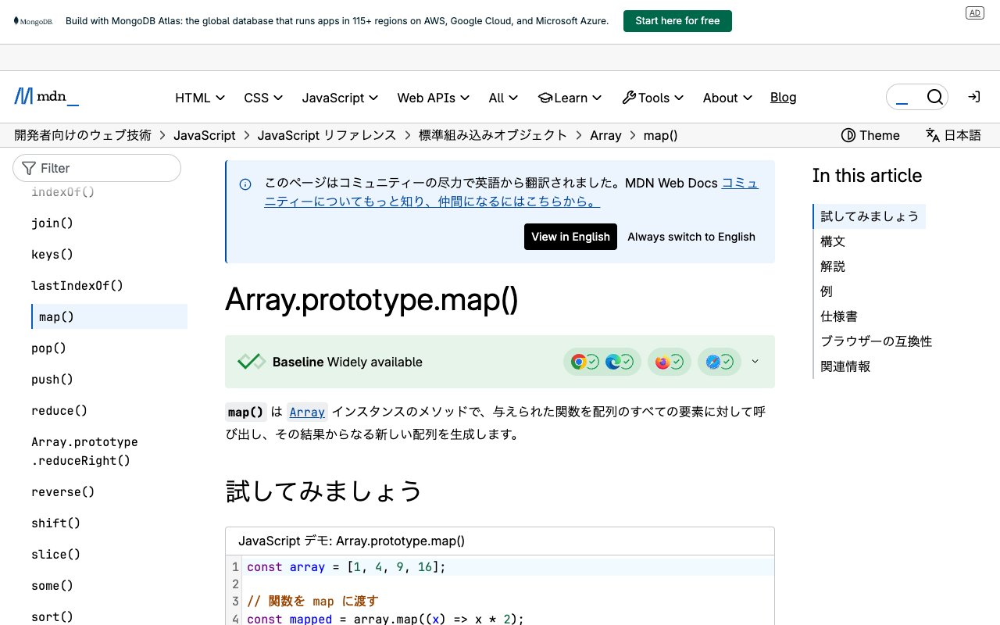
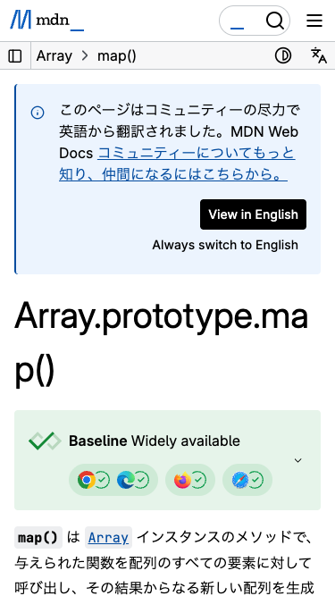

# レスポンシブ対応手順書 — MDN Web Docs

MDN Web Docs の JavaScript トップページから `Array.prototype.map()` リファレンスページまでの操作を、PC 幅とスマホ幅の両方で実行し、デバイスごとの画面差異を記録した手順書です。

---

## Step 1: JavaScript トップページを表示する

`https://developer.mozilla.org/ja/docs/Web/JavaScript` にアクセスし、JavaScript のトップページを表示します。

| PC版（1280×800） | スマホ版（375×667） |
|:---:|:---:|
|  |  |

---

## Step 2: JavaScript リファレンスページに遷移する

ページ内の「JavaScript リファレンス」リンクをクリックし、リファレンスページに遷移します。

| PC版（1280×800） | スマホ版（375×667） |
|:---:|:---:|
|  |  |

---

## Step 3: Array リファレンスページに遷移する

リファレンスページ内の「Array」リンクをクリックし、Array のリファレンスページに遷移します。

| PC版（1280×800） | スマホ版（375×667） |
|:---:|:---:|
|  |  |

---

## Step 4: Array.prototype.map() リファレンスページに遷移する

Array ページ内の「map()」リンクをクリックし、`Array.prototype.map()` のリファレンスページに遷移します。

| PC版（1280×800） | スマホ版（375×667） |
|:---:|:---:|
|  |  |
