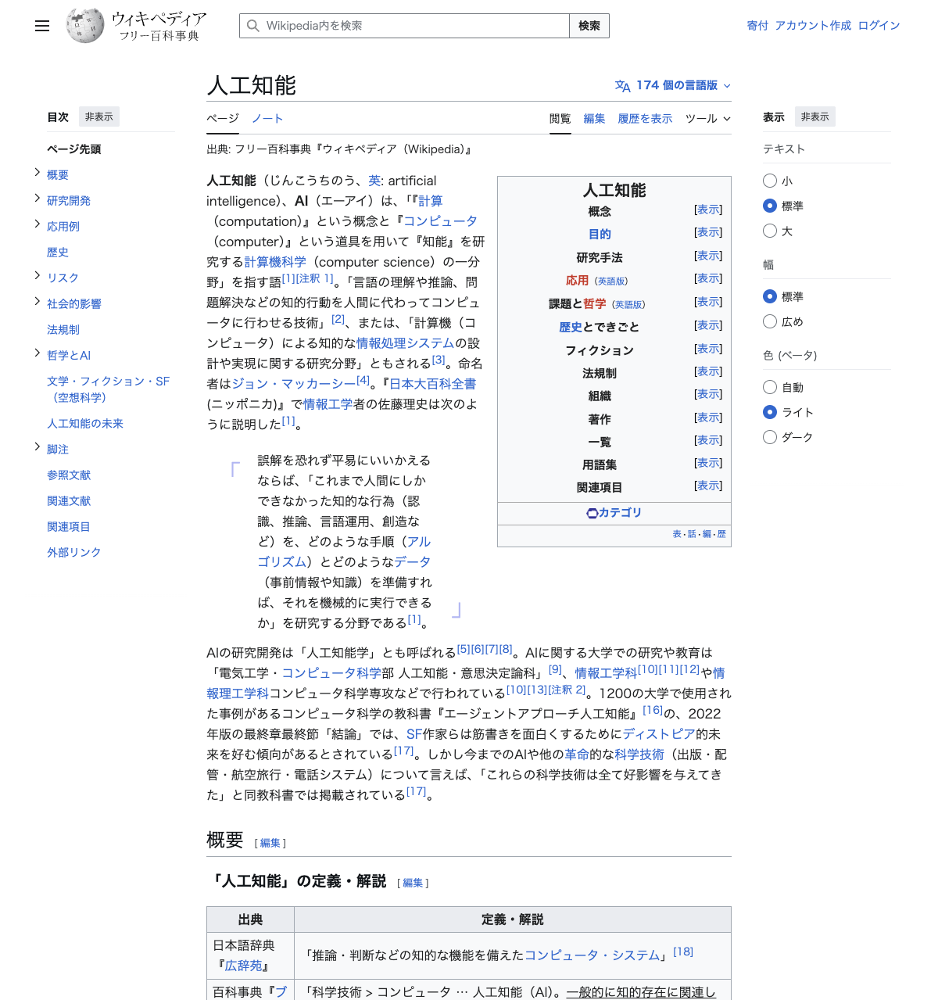
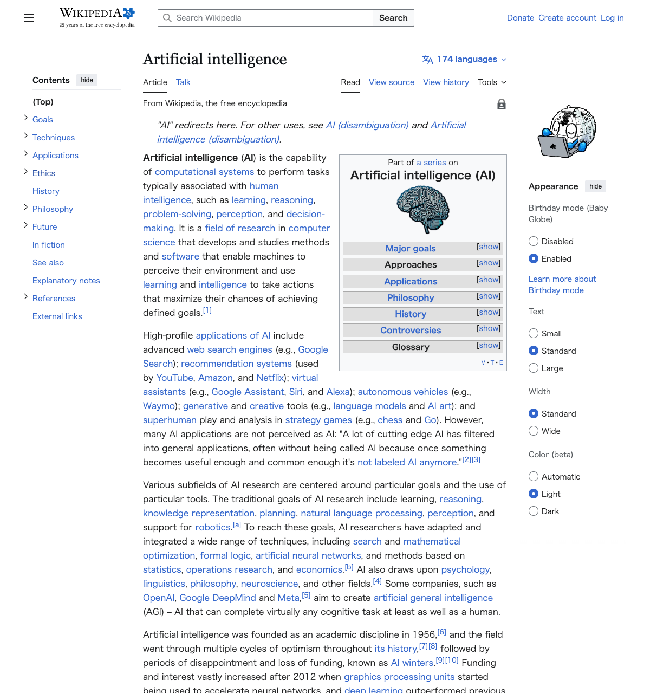
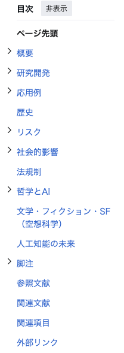
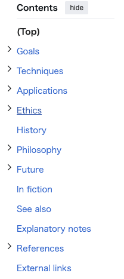
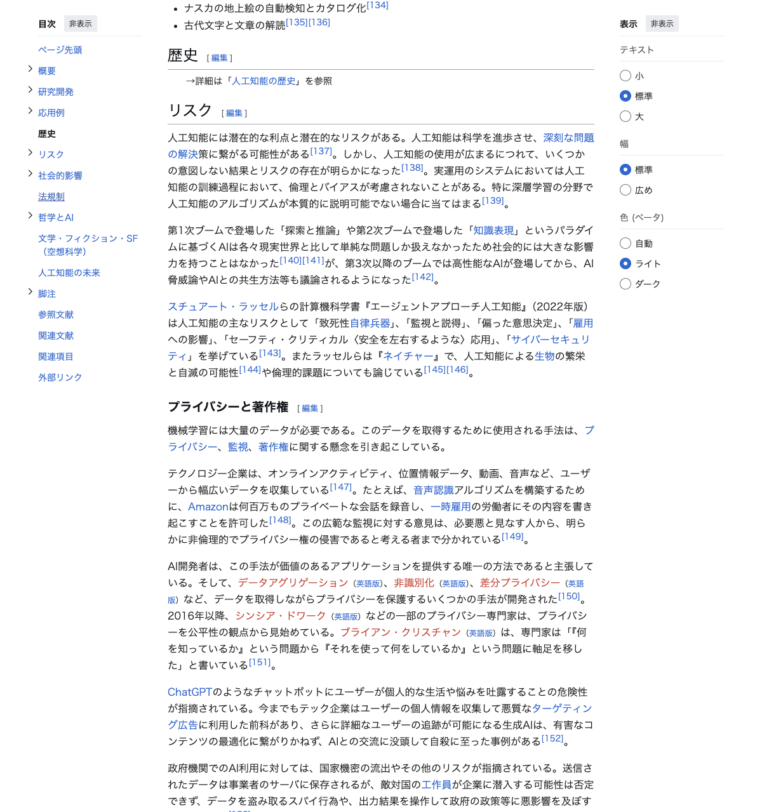
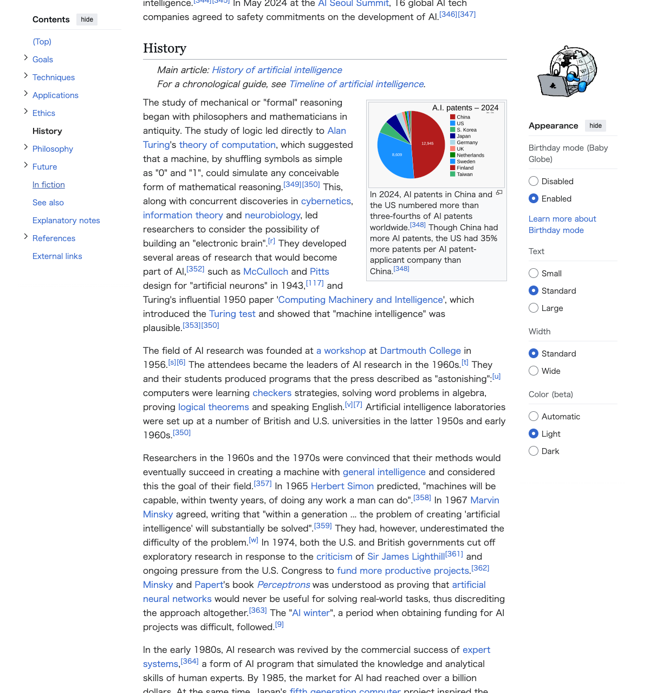

# 多言語差分レポート: Wikipedia「人工知能 / Artificial Intelligence」

**作成日:** 2026年2月28日  
**対象ページ:**
- 日本語版: https://ja.wikipedia.org/wiki/人工知能
- 英語版: https://en.wikipedia.org/wiki/Artificial_intelligence

---

## 1. 目次構造の対比表

日本語版と英語版の目次セクション（トップレベル）の対応関係を以下にまとめる。

| # | 日本語版セクション | 英語版セクション | 対応状況 | 備考 |
|---|---|---|---|---|
| 1 | ページ先頭 | (Top) | ◎ 対応 | ページ最上部へのリンク |
| 2 | 概要 | Goals | △ 部分対応 | 日本語版「概要」は全体の導入、英語版「Goals」はAIの目標に特化。内容範囲が異なる |
| 3 | 研究開発 | Techniques | △ 部分対応 | 日本語版は研究開発全般、英語版は技術手法に焦点。カバー範囲に差異あり |
| 4 | 応用例 | Applications | ◎ 対応 | 内容的に対応するセクション |
| 5 | — | Ethics | ✕ 対応なし | 英語版のみに存在。日本語版では「リスク」「社会的影響」に分散 |
| 6 | 歴史 | History | ◎ 対応 | 両言語に存在するが、日本語版はサブセクションなし、英語版もサブセクションなし |
| 7 | リスク | — | ✕ 対応なし | 日本語版のみに独立セクションとして存在。英語版では「Ethics」に包含 |
| 8 | 社会的影響 | — | ✕ 対応なし | 日本語版のみに独立セクションとして存在。英語版では「Ethics」に包含 |
| 9 | 法規制 | — | ✕ 対応なし | 日本語版のみに独立セクションとして存在 |
| 10 | 哲学とAI | Philosophy | ◎ 対応 | 内容的に対応するセクション |
| 11 | 文学・フィクション・SF（空想科学） | In fiction | ◎ 対応 | 日本語版のセクション名がより詳細 |
| 12 | 人工知能の未来 | Future | ◎ 対応 | 内容的に対応するセクション |
| 13 | 脚注 | Explanatory notes | ◎ 対応 | 参考情報 |
| 14 | 参照文献 | References | ◎ 対応 | 引用文献 |
| 15 | 関連文献 | — | ✕ 対応なし | 日本語版のみ |
| 16 | 関連項目 | See also | ◎ 対応 | 関連記事へのリンク |
| 17 | 外部リンク | External links | ◎ 対応 | 外部サイトへのリンク |

### 対応状況サマリ
- **◎ 対応:** 10 セクション
- **△ 部分対応:** 2 セクション（概要↔Goals、研究開発↔Techniques）
- **✕ 日本語版のみ:** 4 セクション（リスク、社会的影響、法規制、関連文献）
- **✕ 英語版のみ:** 1 セクション（Ethics）

---

## 2. UI構造の比較

### ページトップの比較

| 日本語版 | 英語版 |
|---|---|
|  |  |

### 目次の比較

| 日本語版 | 英語版 |
|---|---|
|  |  |

### 「歴史 / History」セクションの比較

| 日本語版 | 英語版 |
|---|---|
|  |  |

---

## 3. 検出された差異のサマリ

### 3.1 目次構造の差異

| 観点 | 日本語版 | 英語版 |
|---|---|---|
| トップレベルセクション数 | 16 セクション | 13 セクション |
| サブセクションの展開ボタン | あり（概要、研究開発、応用例、リスク、社会的影響、哲学とAI） | あり（Goals、Techniques、Applications、Ethics、Philosophy、Future、References） |
| セクション配置順序 | 概要→研究開発→応用例→歴史→リスク→社会的影響→法規制→哲学→フィクション→未来 | Goals→Techniques→Applications→Ethics→History→Philosophy→Future→In fiction |

**主な構成の違い:**
- 日本語版は「リスク」「社会的影響」「法規制」を独立したセクションとして分割しているが、英語版ではこれらの内容を「Ethics」セクションに統合している。
- 日本語版には「関連文献」セクションが独立して存在するが、英語版には対応するセクションがない。
- セクションの掲載順序が異なる。特に「歴史/History」は日本語版では5番目、英語版では6番目（Ethicsの後）に配置されている。

### 3.2 UI要素の差異

| UI要素 | 日本語版 | 英語版 |
|---|---|---|
| サイトナビゲーション名 | 「サイト」 | 「Site」 |
| メニューボタン | 「メインメニュー」 | 「Main menu」 |
| 検索ボックス | 「Wikipedia内を検索」 | 「Search Wikipedia」 |
| 個人用ツール | 「寄付」「アカウント作成」「ログイン」 | 「Donate」「Create account」「Log in」 |
| 名前空間タブ | 「ページ」「ノート」 | 「Article」「Talk」 |
| 表示タブ | 「閲覧」「編集」「履歴を表示」 | 「Read」「View source」「View history」 |
| 外観設定 | 「表示」→テキスト（小/標準/大）・幅（標準/広め） | 「Appearance」→Birthday mode + Text（Small/Standard/Large）・Width（Standard/Wide）・Color（Automatic/Light/Dark） |
| 目次ヘッダー | 「目次」 | 「Contents」 |
| 目次折りたたみボタン | 「非表示」 | 「hide」 |
| 言語切替ボタン | 「174 個の言語版」 | 「174 languages」 |
| ページ保護表示 | なし | あり（「Page semi-protected」アイコン） |

**注目すべきUI差異:**
- 英語版には「Birthday mode (Baby Globe)」や「Color (beta)」（ダークモード切替）など、日本語版にはない外観設定オプションが存在する。
- 英語版のみ「Page semi-protected」の保護状態アイコンが表示されている。
- 日本語版では「編集」リンクが直接表示されるが、英語版では「View source」（保護されているため直接編集不可）となっている。

### 3.3 「歴史 / History」セクションの内容差異

| 観点 | 日本語版 | 英語版 |
|---|---|---|
| セクション位置 | 目次の5番目 | 目次の6番目 |
| サブセクション展開ボタン | なし | なし |
| 前後のセクション | 前: 応用例 / 後: リスク | 前: Ethics / 後: Philosophy |

- 英語版では「History」の前に「Ethics」セクションが挟まるため、倫理的議論→歴史的経緯→哲学的考察の流れになっているが、日本語版では応用例→歴史→リスクの流れで、実用的な視点からリスク評価へと展開する構成になっている。
- この構成の違いは、各言語版のWikipediaコミュニティによる編集方針や重点分野の差を反映していると考えられる。

---

## 4. 総合所見

1. **セクション粒度の違い:** 日本語版はセクションをより細かく分割する傾向があり（16セクション vs 13セクション）、特に倫理・社会・法規制を独立セクションとして扱っている。
2. **倫理関連の構造差:** 英語版は「Ethics」として倫理的問題を一箇所に統合しているが、日本語版は「リスク」「社会的影響」「法規制」と3つに分離しており、より多角的な整理がされている。
3. **UI機能差:** 英語版には日本語版にない外観設定機能（ダークモード、Birthday mode）が追加されており、UI体験に差がある。
4. **翻訳対応の課題:** 英語版「Ethics」に対応する単一セクションが日本語版に存在しないため、言語間のナビゲーション整合性に課題がある。逆に日本語版の「法規制」「関連文献」に対応するセクションが英語版には存在しない。
