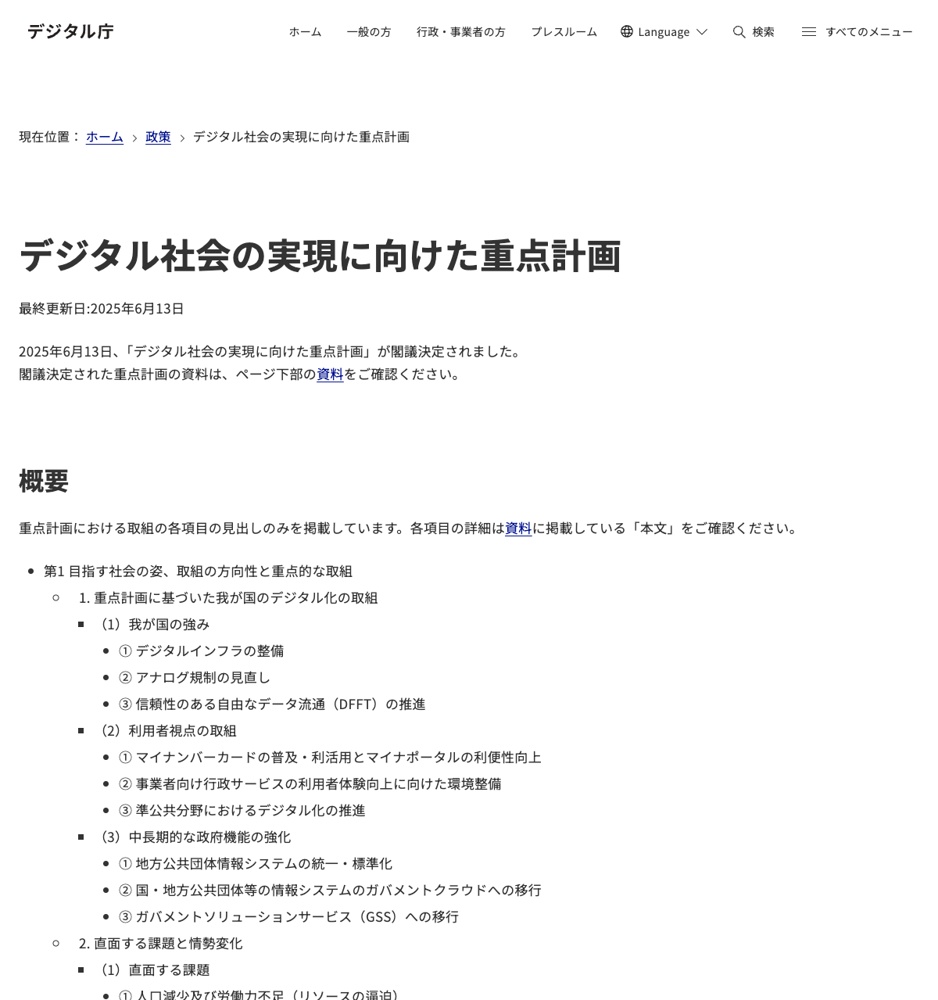
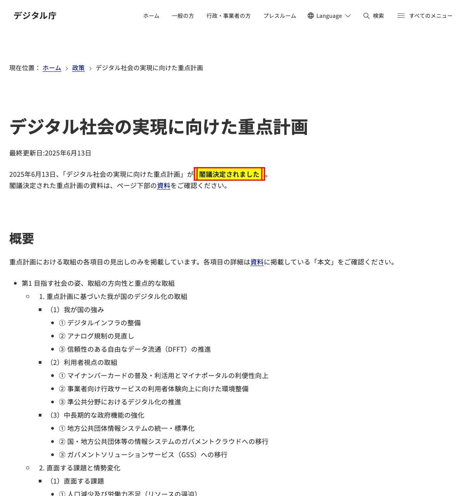
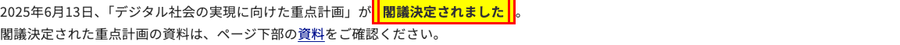

# 重要文言の証拠化 — 操作手順書

## 目的
デジタル庁の重点計画ページにおいて「閣議決定されました」の文言が画面に表示されていることをスクリーンショットで証拠として保存する。

- **対象URL:** `https://www.digital.go.jp/policies/priority-policy-program`
- **対象文言:** 「閣議決定されました」
- **実施日:** 2026年2月28日

---

## ステップ1: デジタル庁 重点計画ページを開く

ヘッドモードでブラウザを起動し、デジタル庁の「デジタル社会の実現に向けた重点計画」ページにアクセスした。

**実行コマンド:**
```bash
playwright-cli open --headed https://www.digital.go.jp/policies/priority-policy-program
```

**結果:**
- ページURL: `https://www.digital.go.jp/policies/priority-policy-program`
- ページタイトル: 「デジタル社会の実現に向けた重点計画｜デジタル庁」

**スクリーンショット（ページ全体の証拠）:**


---

## ステップ2: 対象文言の探索

ページのスナップショットを取得し、「閣議決定されました」の文言を探索した。

**探索結果:**
- 文言はページ上部の本文段落に存在
- 該当テキスト: 「2025年6月13日、「デジタル社会の実現に向けた重点計画」が**閣議決定されました**。」
- 文言を含む段落にスクロールし、画面に表示されている状態を確認

**実行コマンド:**
```bash
playwright-cli hover e73
```

**スクリーンショット（文言が表示されている状態）:**



---

## ステップ3: 文言の証拠スクリーンショット

対象文言「閣議決定されました」を黄色ハイライト＋赤枠で視覚的に強調表示し、証拠としてのスクリーンショットを取得した。

**ハイライト処理コマンド:**
```bash
playwright-cli run-code "async page => {
  await page.evaluate(() => {
    const walker = document.createTreeWalker(document.body, NodeFilter.SHOW_TEXT, null, false);
    while (walker.nextNode()) {
      const node = walker.currentNode;
      if (node.textContent.includes('閣議決定されました')) {
        const range = document.createRange();
        const idx = node.textContent.indexOf('閣議決定されました');
        range.setStart(node, idx);
        range.setEnd(node, idx + '閣議決定されました'.length);
        const span = document.createElement('span');
        span.style.backgroundColor = '#FFFF00';
        span.style.border = '3px solid #FF0000';
        span.style.padding = '2px 4px';
        span.style.fontWeight = 'bold';
        range.surroundContents(span);
        break;
      }
    }
  });
}"
```

**スクリーンショット（ハイライト表示状態）:**



**スクリーンショット（該当段落の拡大）:**



---

## 取得結果一覧

| ファイル名 | 内容 |
|---|---|
| `images/page-full-view.png` | ページ全体のトップ画面 |
| `images/target-text-visible.png` | 対象文言が表示されている状態 |
| `images/target-text-highlighted.png` | 対象文言をハイライト強調表示した状態 |
| `images/target-paragraph.png` | 対象文言を含む段落の拡大表示 |
