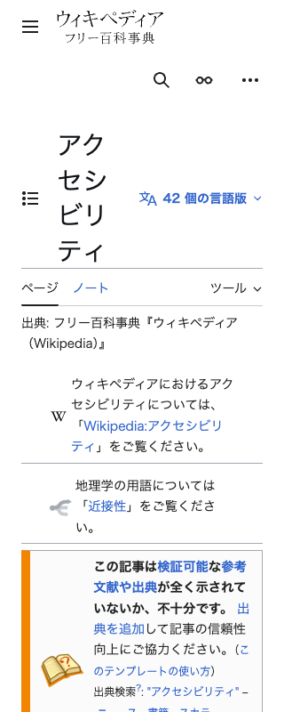
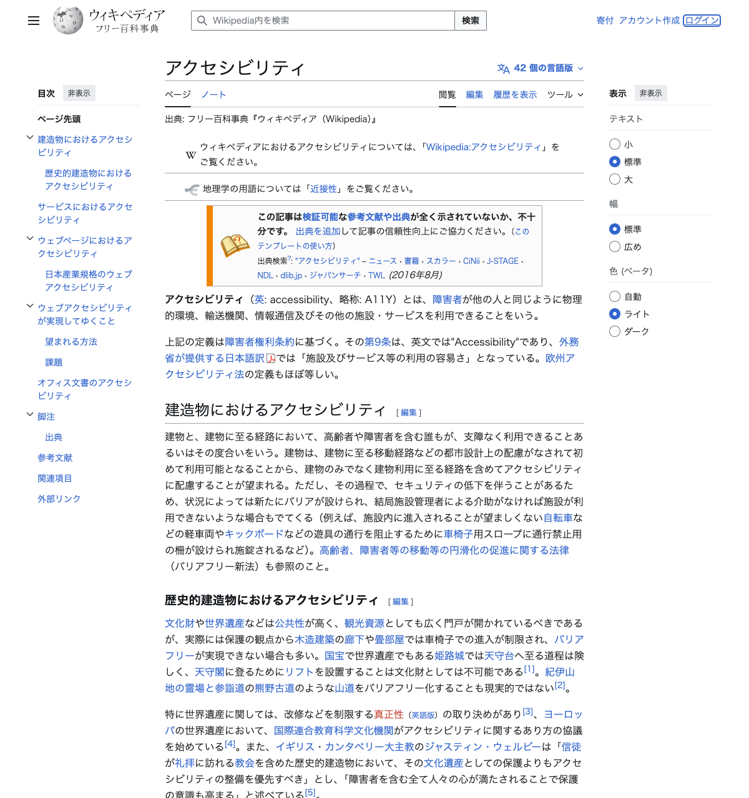
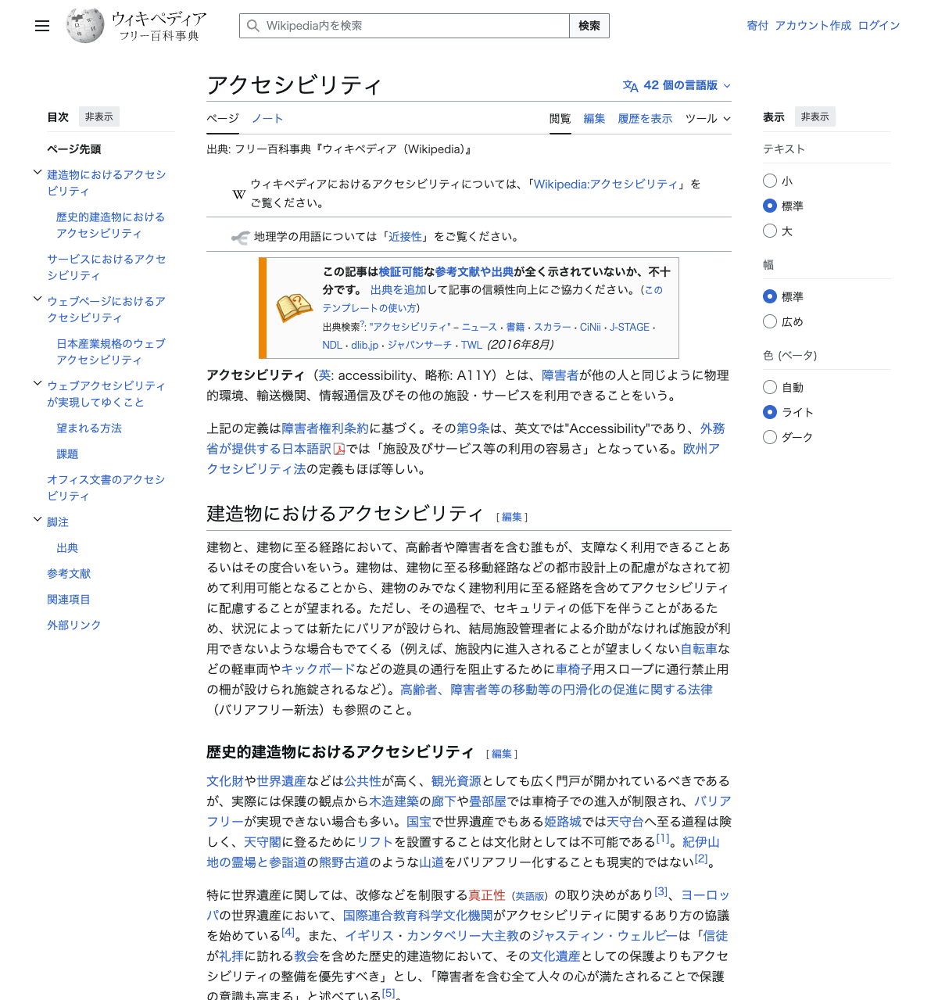

# Webアクセシビリティ評価レポート

## 1. 評価概要

| 項目 | 内容 |
|---|---|
| **対象URL** | https://ja.wikipedia.org/wiki/アクセシビリティ |
| **評価日時** | 2026年3月10日 |
| **適用ガイドライン** | Web Content Accessibility Guidelines (WCAG) 2.1 |
| **適合レベル** | Level AA |
| **評価ツール** | Playwright CLI（DOM情報抽出・キーボード操作テスト・スクリーンショット取得） |

---

## 2. 評価結果サマリ

| 原則 | 判定 | 概要 |
|---|---|---|
| 知覚可能 (Perceivable) | ⚠️ 一部適合 | 画像のalt属性に一部欠落あり。コントラスト比は概ね良好。リフローは問題なし。 |
| 操作可能 (Operable) | ✅ 適合 | キーボード操作・フォーカスインジケータ・スキップリンクいずれも良好。 |
| 理解可能 (Understandable) | ✅ 適合 | lang属性が正しく設定。フォーム要素のラベルも概ね適切。 |
| 堅牢 (Robust) | ⚠️ 一部適合 | 見出し構造に順序の問題あり。セマンティクスHTML・ランドマークは概ね良好。 |

**全体判定: ⚠️ 一部適合**

---

## 3. 原則別 詳細評価

### 3-1. 知覚可能 (Perceivable)

| チェック項目 | WCAG達成基準 | 結果 | 詳細 |
|---|---|---|---|
| 画像の代替テキスト | 1.1.1 | ⚠️ 一部適合 | 全13画像中、意味のあるalt属性は8画像に設定済み。5画像はalt属性が空文字（装飾画像として意図的な可能性あり）。 |
| 色のコントラスト比 | 1.4.3 | ✅ 適合 | 本文テキスト: `rgb(32, 33, 34)` / 背景: 白系。コントラスト比は約15.4:1で基準(4.5:1)を大幅に超過。リンク: `rgb(51, 102, 204)` / 背景: 白系。コントラスト比は約5.0:1で基準を満たす。 |
| テキストの拡大 | 1.4.4 | ✅ 適合 | レスポンシブデザインにより、テキスト拡大時もコンテンツが適切にリフローされる。 |
| リフロー | 1.4.10 | ✅ 適合 | 320px幅でのテスト結果: scrollWidth=320, clientWidth=320。水平スクロールバーは発生せず、コンテンツが正しくリフローされている。 |

**詳細: 画像alt属性の状況**

| 区分 | 数 |
|---|---|
| 画像総数 | 13 |
| alt属性あり（有意味） | 8 |
| alt属性なし/空文字 | 5 |

alt属性が空の画像:
- `https://ja.wikipedia.org/static/images/icons/wikipedia.png` — サイトロゴ（装飾的）
- `https://ja.wikipedia.org/static/images/mobile/copyright/wikipedia-tagline-ja.svg` — タグライン（装飾的）
- `https://upload.wikimedia.org/wikipedia/commons/thumb/6/64/Question_book-4.svg/60px-...` — アイコン画像
- `https://upload.wikimedia.org/wikipedia/commons/thumb/1/14/3層構造.png/250px-...` — 記事内の図版（**alt推奨**）
- `https://upload.wikimedia.org/wikipedia/commons/thumb/4/47/Question_mark_on_a_scroll.svg/40px-...` — アイコン画像

> **注記**: ロゴやアイコンなど装飾的な画像に `alt=""` を設定するのはWCAGの推奨ですが、記事内の情報を伝える図版（3層構造.png）にはalt属性が必要です。

**リフロー確認スクリーンショット（320px幅）:**

---

### 3-2. 操作可能 (Operable)

| チェック項目 | WCAG達成基準 | 結果 | 詳細 |
|---|---|---|---|
| キーボード操作 | 2.1.1 | ✅ 適合 | Tab キーによるフォーカス移動が正常に動作。全てのインタラクティブ要素にキーボードでアクセス可能。 |
| フォーカスインジケータ | 2.4.7 | ✅ 適合 | フォーカス時にvisual indicatorが表示され、現在のフォーカス位置が視認可能。 |
| スキップリンク | 2.4.1 | ✅ 適合 | 「コンテンツにスキップ」（`#bodyContent`）リンクがページ先頭に存在。Tab操作で最初にフォーカスされる。 |
| リンクの目的 | 2.4.4 | ⚠️ 一部適合 | 全314リンク中、テキストが空のリンクが9件。「こちら」「ここ」等の汎用テキストは0件。 |

**フォーカスインジケータ確認スクリーンショット:**

**スキップリンク:**
- 「コンテンツにスキップ」→ `#bodyContent` — ✅ 存在確認済み
- 「ページ先頭」→ `#` — ✅ 存在確認済み

**リンクテキストの分析:**

| 区分 | 数 |
|---|---|
| リンク総数 | 314 |
| テキストが空のリンク | 9 |
| 汎用テキスト（「こちら」「ここ」等） | 0 |

---

### 3-3. 理解可能 (Understandable)

| チェック項目 | WCAG達成基準 | 結果 | 詳細 |
|---|---|---|---|
| ページの言語 | 3.1.1 | ✅ 適合 | `<html lang="ja">` が正しく設定されている。 |
| 部分的な言語指定 | 3.1.2 | ✅ 適合 | 47要素に個別の `lang` 属性が設定されており、多言語コンテンツが適切にマークアップされている。 |
| フォームラベル | 3.3.2 | ✅ 適合 | 検索ボックスに `aria-label` 設定済み。チェックボックス・ラジオボタンには `label[for]` と `aria-label` の両方が設定。 |

**フォーム要素のラベル状況:**

| 要素タイプ | 数 | ラベル設定状況 |
|---|---|---|
| search (検索ボックス) | 2 | aria-label設定済み（1つはラベルなし ※sticky headerの検索） |
| checkbox | 7 | label + aria-label 設定済み |
| radio | 8 | label 設定済み |
| hidden | 2 | ラベル不要 |

---

### 3-4. 堅牢 (Robust)

| チェック項目 | WCAG達成基準 | 結果 | 詳細 |
|---|---|---|---|
| 見出し構造 | 1.3.1 | ⚠️ 一部適合 | H2「目次」がH1「アクセシビリティ」より前に出現。ページ内の論理的な見出し順序としてはやや不自然。 |
| ARIAランドマーク | 4.1.2 | ✅ 適合 | `role="search"`, `role="navigation"`, `role="button"`, `role="presentation"` が適切に設定。 |
| セマンティクスHTML | 1.3.1 | ✅ 適合 | `<nav>`: 12, `<main>`: 1, `<header>`: 2, `<footer>`: 1 を確認。主要なセマンティクス要素が使用されている。 |

**見出し構造の詳細:**

| レベル | テキスト | 問題 |
|---|---|---|
| H2 | 目次 | ⚠️ H1より先に出現 |
| H1 | アクセシビリティ | ページタイトル |
| H2 | 建造物におけるアクセシビリティ | — |
| H3 | 歴史的建造物におけるアクセシビリティ | — |
| H2 | サービスにおけるアクセシビリティ | — |
| H2 | ウェブページにおけるアクセシビリティ | — |
| H3 | 日本産業規格のウェブアクセシビリティ | — |
| H2 | ウェブアクセシビリティが実現してゆくこと | — |
| H3 | 望まれる方法 | — |
| H3 | 課題 | — |
| H2 | オフィス文書のアクセシビリティ | — |
| H2 | 脚注 | — |
| H3 | 出典 | — |
| H2 | 参考文献 | — |
| H2 | 関連項目 | — |
| H2 | 外部リンク | — |

> **注記**: H2→H3の遷移は適切で、レベルの飛び（例: H1→H3）は見られませんでした。ただし「目次」がH1より前にH2として配置されている構造は改善の余地があります。

**セマンティクス要素の使用状況:**

| 要素 | 使用数 |
|---|---|
| `<nav>` | 12 |
| `<main>` | 1 |
| `<header>` | 2 |
| `<footer>` | 1 |
| `<article>` | 0 |
| `<aside>` | 0 |

**ARIAロール一覧:**

| ロール | 要素 | 用途 |
|---|---|---|
| search | DIV | 検索領域（2箇所） |
| navigation | DIV | ナビゲーション |
| button | INPUT | ボタン操作（7箇所） |
| presentation | TABLE | レイアウト用テーブル（3箇所） |

---

## 4. 検出された問題一覧

### 問題 1: 記事内図版のalt属性不足

| 項目 | 内容 |
|---|---|
| **重要度** | 中 |
| **WCAG達成基準** | 1.1.1 非テキストコンテンツ |
| **問題の内容** | 記事内の「3層構造.png」画像にalt属性が設定されていない（空文字）。この画像は記事の内容を説明する情報画像であり、代替テキストが必要。 |
| **該当箇所** | `https://upload.wikimedia.org/wikipedia/commons/thumb/1/14/3層構造.png/250px-...` |
| **改善提案** | 画像の内容を説明する適切なalt属性を設定する（例: `alt="アクセシビリティの3層構造を示す図"`）。 |

### 問題 2: テキストが空のリンク

| 項目 | 内容 |
|---|---|
| **重要度** | 中 |
| **WCAG達成基準** | 2.4.4 リンクの目的（コンテキスト内） |
| **問題の内容** | テキストコンテンツが空で、かつalt付きimgも含まれていないリンクが9件存在。スクリーンリーダーユーザーがリンクの目的を理解できない。 |
| **該当箇所** | ページ内の各種ナビゲーション・UIリンク |
| **改善提案** | 空のリンクに `aria-label` を設定するか、意味のあるテキストを追加する。装飾目的のリンクは `aria-hidden="true"` でスクリーンリーダーから隠す。 |

### 問題 3: 見出し構造の順序問題

| 項目 | 内容 |
|---|---|
| **重要度** | 低 |
| **WCAG達成基準** | 1.3.1 情報及び関係性 / 2.4.6 見出し及びラベル |
| **問題の内容** | H2「目次」がH1「アクセシビリティ」より前に配置されている。DOM順序上、ページの主見出しの前にセクション見出しが来ている。 |
| **該当箇所** | 目次セクション（`<h2>目次</h2>`） |
| **改善提案** | 目次セクションをH1の後に移動するか、CSSで視覚的な位置を調整しつつDOM順序を修正する。ただし、WikipediaのCMSテンプレートの制約もあるため、対応の優先度は低い。 |

### 問題 4: sticky header検索ボックスのラベル不足

| 項目 | 内容 |
|---|---|
| **重要度** | 低 |
| **WCAG達成基準** | 3.3.2 ラベル又は説明 |
| **問題の内容** | sticky header内の検索ボックスにidが設定されておらず、label要素との関連付けとaria-labelの両方が欠けている。 |
| **該当箇所** | sticky header内の`<input type="search">` |
| **改善提案** | `aria-label="Wikipedia内を検索"` 等のアクセシブルラベルを追加する。 |

---

## 5. 総合評価と改善提案

### 全体的な評価

日本語版Wikipediaの「アクセシビリティ」記事は、**WCAG 2.1 Level AAの基準を概ね満たしています**。特に以下の点が優れています：

- ✅ `lang="ja"` 属性が正しく設定され、多言語コンテンツにも個別のlang属性が47要素に付与されている
- ✅ 「コンテンツにスキップ」スキップリンクが適切に実装されている
- ✅ キーボード操作が正常に動作し、フォーカスインジケータが視認可能
- ✅ 320px幅でのリフローが水平スクロールなしに正常動作
- ✅ テキストの色コントラスト比が基準を大幅に上回っている（本文約15.4:1）
- ✅ セマンティクスHTML（`<nav>`, `<main>`, `<header>`, `<footer>`）とARIAランドマークが適切に使用されている

### 優先度の高い改善項目

| 優先度 | 問題 | WCAG達成基準 | 対応内容 |
|---|---|---|---|
| 1（中） | 記事内図版のalt属性不足 | 1.1.1 | 情報画像に適切な代替テキストを設定 |
| 2（中） | 空テキストリンク | 2.4.4 | aria-labelの追加またはテキスト追加 |
| 3（低） | 見出し構造の順序 | 1.3.1 | DOM順序の見直し |
| 4（低） | sticky header検索ボックス | 3.3.2 | aria-labelの追加 |

### ページ全体のスクリーンショット

### 参考

- [WCAG 2.1 ガイドライン](https://www.w3.org/TR/WCAG21/)
- [WCAG 2.1 日本語訳](https://waic.jp/translations/WCAG21/)
- [Web Accessibility Initiative (WAI)](https://www.w3.org/WAI/)
